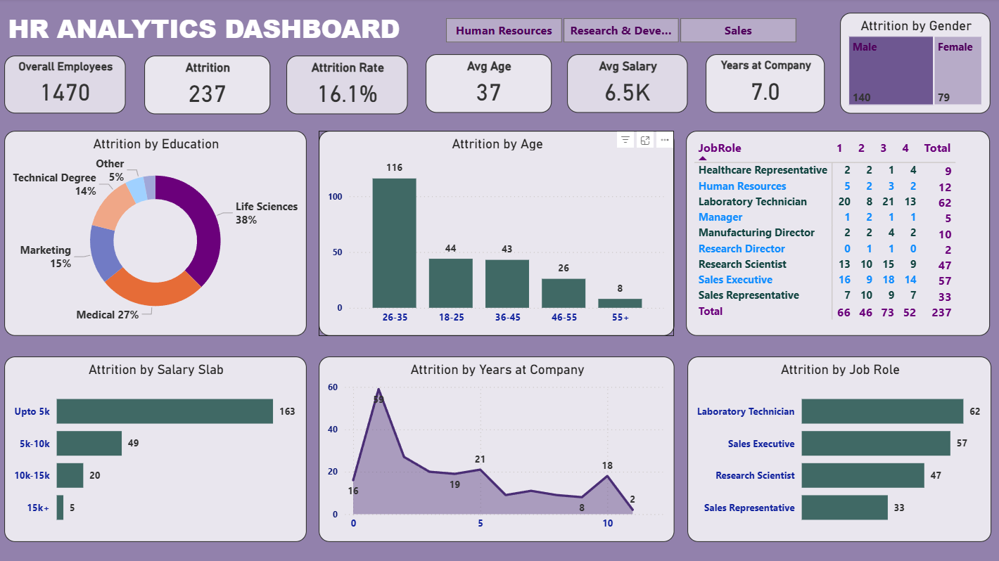

# 👥 HR Analytics Attrition Dashboard (Power BI)

This Power BI dashboard provides a clear and interactive view of **employee attrition trends** within an organization.  
It examines workforce patterns across age groups, salary slabs, education fields, job roles, departments, travel frequency, gender, and years of service.  
The goal is to help HR teams identify the key drivers of employee turnover and support data-driven retention strategies.

---

## 📌 Project Overview

The dashboard analyzes a complete HR dataset consisting of **1470 employees**, with **237 recorded attritions**, giving an overall attrition rate of **16.1%**.  
Using visual storytelling and clean metrics, the report highlights which segments of the workforce are at higher risk of leaving and why.

This project demonstrates skills in **data cleaning, DAX calculations, Power Query, and interactive dashboard design**.

---

## 🧹 Data Cleaning & Preparation

Before building the dashboard, the dataset was refined to ensure accurate reporting:

- Removed duplicate employee records  
- Handled missing values using imputation or row-level cleanup  
- Standardized categorical fields (Education Field, Job Role, Department, Travel Frequency, etc.)  
- Created age groups, salary slabs, and experience brackets  
- Verified data types to maintain model integrity  
- Added calculated columns (e.g., AttritionCount, Age Group)

These steps ensured a clean and analysis-ready dataset.

---

## 📊 Key Insights from the Dashboard

### **1. Department-Level Attrition**
- Sales shows the **highest attrition**  
- Research & Development has **lower attrition** in comparison  
- HR records a moderate level of turnover  

### **2. Salary-Based Trends**
- The **lowest salary slab (up to 5K)** contributes the largest share of attrition  
- Higher salary ranges see significantly lower turnover  

### **3. Age & Career Stage**
- Employees aged **26–35** show the highest attrition  
- Younger employees (18–25) also leave frequently  
- Employees aged **55+** have the lowest attrition  

### **4. Experience/Years at Company**
- Majority of departures occur in the **first 1–3 years**  
- Attrition stabilizes after longer tenure  

### **5. Job Roles**
Top roles affected by attrition:  
- Laboratory Technician  
- Sales Executive  
- Research Scientist  
- Sales Representative  

### **6. Gender Insights**
- Attrition is higher among **male employees** compared to females  

---

## 🖥 Dashboard Features

- **Dynamic KPIs** for Total Employees, Attrition Count, Attrition Rate, Avg Age, Avg Salary, Years at Company  
- **Donut charts, bar charts, line charts, and heat tables** for easy comparison  
- **Slicers** to filter data by Department, Gender, Age Group, Job Role, and Travel Frequency  
- Segmented views for:
  - Attrition by Education Field  
  - Attrition by Salary Slab  
  - Attrition by Years at Company  
  - Attrition by Job Role  
  - Attrition by Gender  
  - Department-specific attrition patterns  

The dashboard is designed in a clean purple theme with consistent formatting for readability and professional presentation.

---

## 🛠 Tools & Technologies Used

- **Power BI Desktop** — Data modeling, DAX measures, visuals, and report design  
- **Power Query** — Data cleaning and transformation  
- **CSV Dataset** — Raw employee data used for analysis  
- **DAX** — Custom measures for attrition rate, salary groups, and KPIs

---

## 📸 Dashboard Preview  

